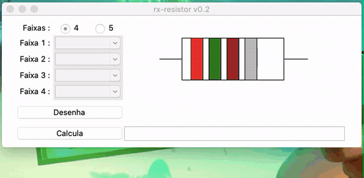
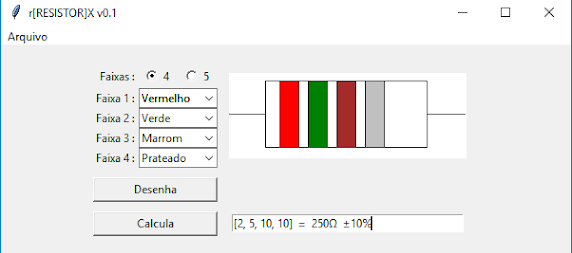

rx-resistor
-----------

This is a python3/tk written software aiming to help electronics students being able to identify resistors values easily.

Features:
- 4 or 5 bands
- Brazillian Portuguese (pt_BR) interface 

Binaries:
- Binaries are provided for Windows 10 - 64bits 
- MacOS >= 10.14.5

Screenshot
----------

